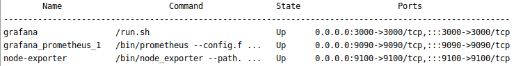
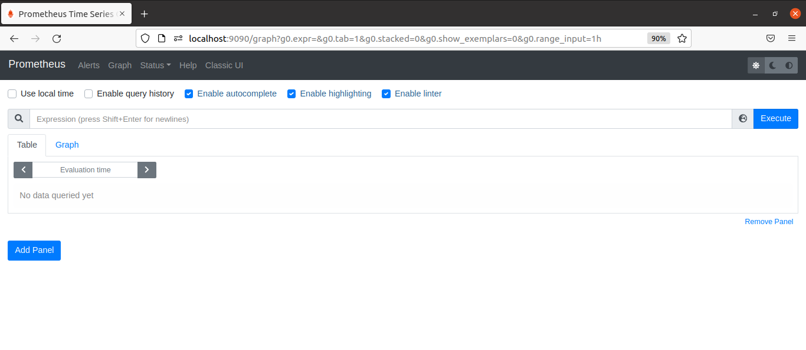
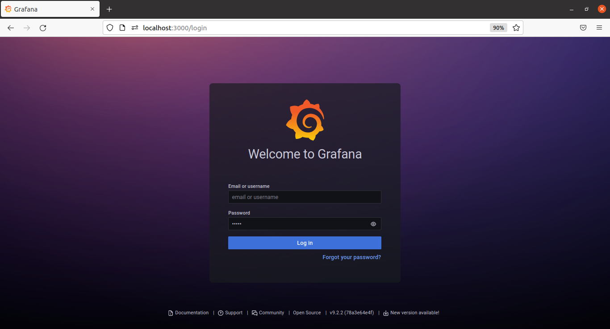
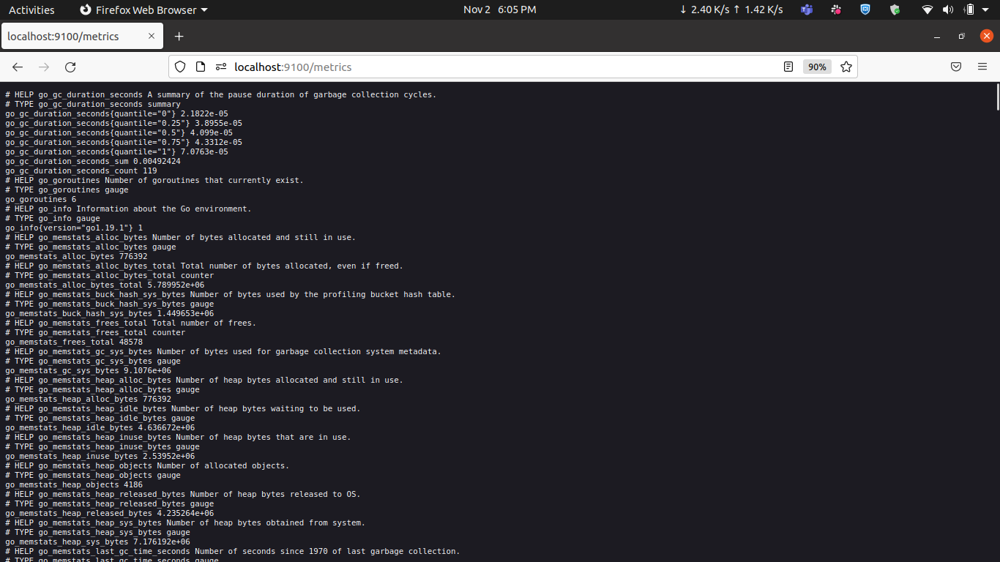

         

    <image src=https://img.shields.io/badge/Grafana-brightgreen></image>
    <image src="https://img.shields.io/badge/Prometheus-ff69b4"></image>
    <image src="https://img.shields.io/badge/Node_exporter-orange"></image>

# Monitoring a Linux host using Grafana,Prometheus and Node_exporter
## Prerequisites
* Docker 
  * Installation steps will now be reachable at  [Docker Install](https://docs.docker.com/engine/install/)

##  How to run it locally

   1. Create a folder named monitoring and add the follwing files in the folder.
   2. Create a file named prometheus.yml [here](./prometheus.yml).
   3. Create a file named grafana.ini [here](./grafana.ini). 
   4. Open the prometheus.yml file and edit the IP of the Virtual Machine/Local system IP.
   5. Execute the given commands to make the docker services up and running
         * docker-compose up -d
   6. Check the status of service.
         * docker-compose ps
          
         
   7. Prometheus will now be reachable at  [http://localhost:9090](http://localhost:9090) 
   
         
       9. Grafana will now be reachable at  [http://localhost:3000](http://localhost:3000)
         * By default Username and Password will be admin
   
         
         
        

  10. Node_exporter will now be reachable at [http://localhost:9100](http://localhost:9100/metrics)
   
         
    
  
